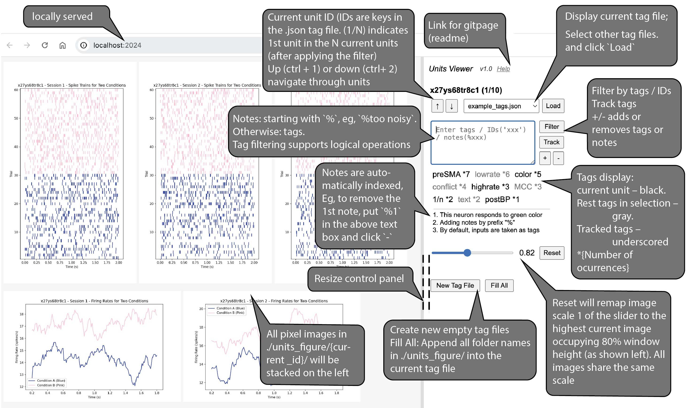

## Introduction

Units Viewer is a tool tailored for researchers working with datasets composed of multiple units, such as neurons. It is ideal for handling large datasets, offering streamlined navigation through figures, easy tagging, and flexible filtering options. This tool facilitates the building of intuition by allowing efficient and organized inspection of each unit.

## Features

- View detailed profiles of individual neurons.
- Tagging system to annotate units with customizable tags and notes.
- Flexible filtering based on tags to streamline the analysis process.
- Easy navigation through large datasets.
- Local web-based interface for easy access.

A quick introduction of the panel

## Installation

This project is built with Node.js. Before starting, ensure that Node.js is installed on your system. You can find instructions in our [Node.js Installation Guide](install_node.md) (generated by chatGPT).

### Getting Started

1. Clone the repository or download the `units_viewer` folder to your local machine.
2. Open your terminal and navigate to the project directory.
3. Run `npm install` to install all required dependencies.
4. Place your unit images in the `./units_figures` directory, organized by subfolders named with unit IDs.
5. Optionally, place your custom `tags.json` file in `./units_tags`. This file should be a JSON-formatted dictionary where keys are unit IDs, and values are lists of tags or notes (notes prefixed by `%`).

## Usage

### Starting the Viewer

1. Ensure that the images are correctly placed in their respective folders.
2. From the terminal or your IDE, navigate to the `units_viewer` directory and execute `npm start`. This will open the viewer in your default web browser.
3. If it does not automatically open, you can manually access it by visiting `http://localhost:2024`.
4. If there is no `.json` file in `./units_tags`, you can create a new one by clicking `New Tag File`. Consider adding the names of all image folders as keys to this new file.

### Navigation and Tagging

- Navigate between units using the arrow keys (↑ for previous, ↓ for next) or by pressing `Ctrl+1` and `Ctrl+2`.
- Tags can be added or removed by entering the tag in the text box and clicking `+` or `-`.
- Notes can be added by prefixing the text with `%` and clicking `+`.

### Filtering

- Use the input box to enter queries for unit IDs and tags.
- Quoted strings will match parts of unit IDs while unquoted strings represent tags. 
- Supports *logical operations like `&` (AND), `|` (OR), `!` (NOT)*, with priorities: `!` > `&` > `|`
- To reset the filter and include all units, submit an empty query.

## Contributing

Contributions are welcome! If you have suggestions for improvements or bug fixes, please open an issue or submit a pull request.

## License

This project is licensed under the [MIT License](LICENSE).

## Support

For support, email me at [vince.sun@nyu.edu](mailto:vince.sun@nyu.edu) or leave a message on the GitHub issues page.

Thank you for using Units Viewer!
